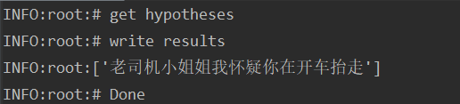
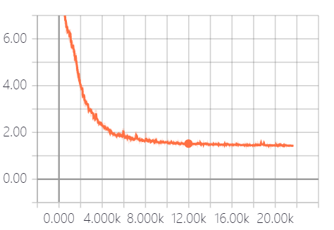
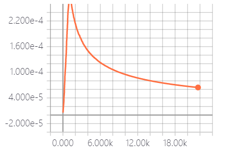
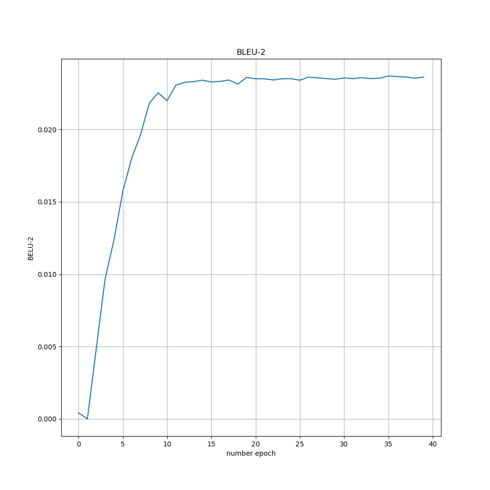

# Barrages generate
弹幕生成模型，主要用到了transformer生成器。

## Requirements
* python==3.x (Let's move on to python 3 if you still use python 2)
* tensorflow==1.12.0
* numpy>=1.15.4
* sentencepiece==0.1.8
* tqdm>=4.28.1

## Dataset
虎牙直播中，绝地求生的弹幕语料。其数据存放在：
```
barrages_data/train_data_has_neg.txt
```

## Training
* STEP 1. 运行下面的命令，生成预处理的弹幕语料
```
python pretreatment/prepro.py
```
如果你想调整默认的词典大小(default:32000)，可以进行下面的命令：
```
python pretreatment/prepro.py --vocab_size 8000
```
它会创建两个文件 `barrages_data/prepro` and `barrages_data/segmented`.

* STEP 2. 训练模型
```
python train.py
```
参数设置放在 `hparams.py` ，可以根据里面的参数进行对应设置，比如：
```
python train.py --logdir myLog --batch_size 256 --dropout_rate 0.5
```

* STEP 3. 根据输入的句子，生成弹幕
```
python barrrages_generate.py
```

## Result
当输入：
```
老司机
```

输出句子：




## Training Loss Curve


## Learning rate


## Bleu score on devset


